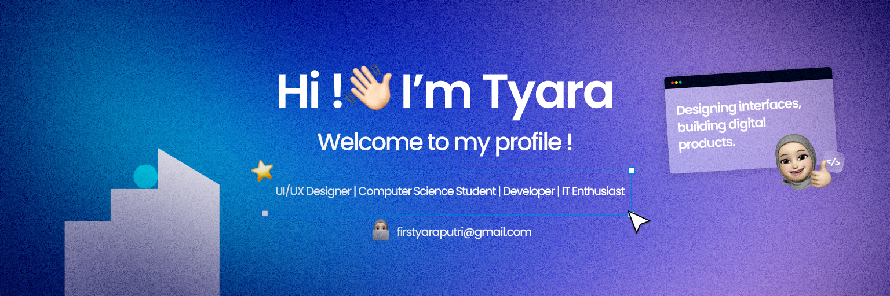

<!-- Banner -->

###

###  About Me

###

<h4 align="left"><b>
Welcome to my GitHub profile! Here I keep track of my coding journey — from small steps to bigger projects.  
I’m constantly improving, so stay tuned!
</b></h4>

- 🚀 Just started my journey as a Computer Science student  
- 💻 Currently learning Java and improving my coding skills  
- 💫 Outside of studying, I enjoy music and relaxing

###

<!--  -->

###

<h3 align="left"> Language and Tools</h3>

###

## 🛠 Tech Stack

| Category             | Technologies |
|----------------------|--------------|
| **📝 Languages**     |       |
| **🎨 Frontend**      |   |
| **🗄️ Backend**       |   |
| **🛢 Databases**     |    |
| **⚙️ DevOps**        |   |
| **🧰 Tools**         |    |

###

<h3 align="left"> My GitHub Stats</h3>

  <picture>
    <source media="(prefers-color-scheme: dark)" srcset="https://github-readme-stats.vercel.app/api?username=ki1rei&hide_title=false&hide_rank=false&show_icons=true&include_all_commits=true&count_private=true&disable_animations=false&theme=dracula&locale=en&hide_border=false">
    <source media="(prefers-color-scheme: light)" srcset="https://github-readme-stats.vercel.app/api?username=ki1rei&hide_title=false&hide_rank=false&show_icons=true&include_all_commits=true&count_private=true&disable_animations=false&theme=default&locale=en&hide_border=false">
    
  </picture>
  <picture>
    <source media="(prefers-color-scheme: dark)" srcset="https://github-readme-stats.vercel.app/api/top-langs?username=ki1rei&locale=en&hide_title=false&layout=compact&card_width=320&langs_count=5&theme=dracula&hide_border=false">
    <source media="(prefers-color-scheme: light)" srcset="https://github-readme-stats.vercel.app/api/top-langs?username=ki1rei&locale=en&hide_title=false&layout=compact&card_width=320&langs_count=5&theme=default&hide_border=false">
    
  </picture>

###

<h3 align="left"> Currently Vibing To</h3>

###

<picture>
  <source media="(prefers-color-scheme: dark)" srcset="https://raw.githubusercontent.com/ki1rei/ki1rei/output/pacman-contribution-graph-dark.svg">
  <source media="(prefers-color-scheme: light)" srcset="https://raw.githubusercontent.com/ki1rei/ki1rei/output/pacman-contribution-graph.svg">
  
</picture>

###
